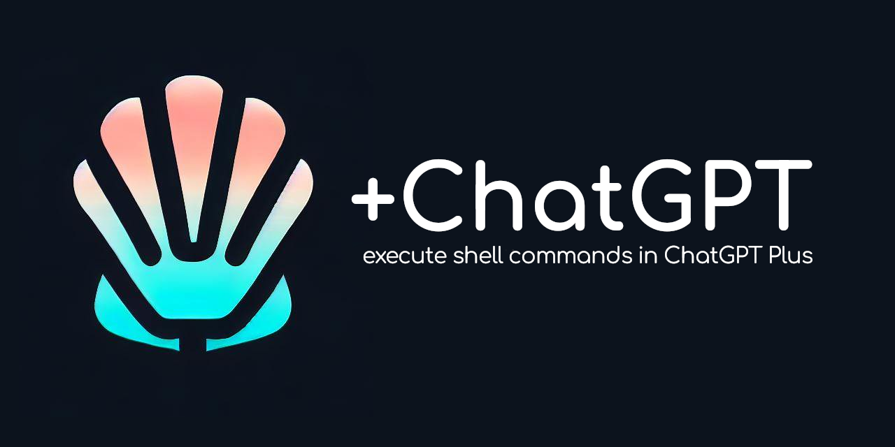

# ⭐ ChatGPT-ShellMaster (ChatGPT 4 Plugin) ⭐
#### checked 08.07.2023 (works well)

ChatGPT ShellMaster is a cross-platform (unix/linux) plugin for OpenAI's ChatGPT 4. Transform your chat into a powerful command-line interface (CLI) for executing scripts, managing files, and monitoring processes.

ChatGPT ShellMaster leverages the strength of CLI while offering a friendly and intuitive chat environment, making complex tasks more interactive and approachable.

⚠️ Please note that this is a plugin for ChatGPT Plus! In order to use it, you'll need access to both a developer account and a ChatGPT Plus Account. As with all powerful tools, remember to use this responsibly and always be mindful of the potential security implications.

See [ChatGPT ShellMaster in ChatGPT Plus with GPT4](img/shellmaster0.png)

## Features

- Execute Linux/Unix commands directly from the ChatGPT interface.
- Handle multiple commands simultaneously with asynchronous execution.
- Fetch, analyze, and store files interactively from your chat.
- Configure the working directory for command execution for flexibility and security.
- Works with temporary directories to reduce risk of unintentional file manipulation.
- Learn Linux/Unix systems with interactive guides.

## useful secure Prompts
- [Handling Large Files](https://github.com/VolkanSah/ChatGPT-ShellMaster/blob/main/prompts/Handling-Large-Files.md)
- [Analyzing and Managing Log Files](https://github.com/VolkanSah/ChatGPT-ShellMaster/blob/main/prompts/Analyzing-and-Managing-Log-Files.md)
- [Learning Linux/Unix with ChatGPT and Shellmaster Plugin](https://github.com/VolkanSah/ChatGPT-ShellMaster/blob/main/prompts/learning-linux-unix-with-ChatGPT.md)

### Overview
Logo | Name | System
-- | -- | --
 |  ChatGPT-ShellMaster Cross-Platform Command Execution Plugin | Unix/linux
 | sorry will not create it???, PowerShell makes to much errors! | Windows

## Installation
- Clone this repository to your local machine.
- Install the required Python modules.

```bash
pip install quart
pip install quart-cors
````
Configure the working directory for command execution by editing the settings.json file. The default is /tmp, which is recommended for its safety and security. However, you can modify it as per your needs, ensuring the new directory has a minimum chmod of 700.

## Usage
To get started, run the plugin using the following command:

```python
python3 main.py
```
Next, navigate to your ChatGPT Plus Account. Under Settings, enable the Developer Tools ([see image for reference](img/settings.png)). Switch to the GPT-4 tab and then proceed to the Plugin Store. At the bottom of the Plugin Store page, you'll find a link titled "Develop your own plugin" ([see image](img/pluginshop.png)). Click on this link and enter your information as required.

In my example, I used localhost:5004. You can use another port such as 2323 or 8080, but please ensure that your firewall or security software isn't blocking the connection ([see image](img/load.png)).

To use this plugin, you'll need to send a POST request to the /command endpoint of the server. The request should contain a JSON body with a command field, representing the command you wish to execute.

Example:
```json
{
  "command": "echo 'Hello, World!'"
}
```
Alternatively, you can simplify your workflow by directly instructing ChatGPT, saying: "You have access to my CLI, please execute ...". The rest will be taken care of for you!

The server will execute the command and return the output. If the command fails, the server will return an error message.

## Security
Please be aware that this plugin executes commands as-is, without any sanitization or security checks. Make sure to only use it in a secure and controlled environment, and do not expose the server to the public internet. This ChatGPT Plugin is designed for developers, and should not be deployed on production servers! Use it only on localhost!

## Contributing
Contributions are welcome! Please feel free to submit a pull request.

## ❤️ Thank you for your support!
If you appreciate my work, please consider supporting me:

- Become a Sponsor: [Link to my sponsorship page](https://github.com/sponsors/volkansah)
- :star: my projects: Starring projects on GitHub helps increase their visibility and can help others find my work. 
- Follow me: Stay updated with my latest projects and releases.


### 👣 other GPT stuff 
- [GPT-Security-Best-Practices](https://github.com/VolkanSah/GPT-Security-Best-Practices)
- [OpenAi cost calculator](https://github.com/VolkanSah/OpenAI-Cost-Calculator)
- [GPT over CLI](https://github.com/VolkanSah/GPT-over-CLI)
- [Secure Implementation of Artificial Intelligence (AI)](https://github.com/VolkanSah/Implementing-AI-Systems-Whitepaper)
- [Comments Reply with GPT (davinci3)](https://github.com/VolkanSah/GPT-Comments-Reply-WordPress-Plugin)
- [Basic GPT Webinterface](https://github.com/VolkanSah/GPT-API-Integration-in-HTML-CSS-with-JS-PHP)


### Copyright
- [Volkan Kücükbudak //NCF](https://gihub.com/volkansah)
- [Link to ChatGPT Shellmaster](https://github.com/VolkanSah/ChatGPT-ShellMaster/)

### License
This project is licensed under the "Help the World Grow [💔](https://jugendamt-deutschland.de) " License . See the [LICENSE](LICENSE) file for details 
